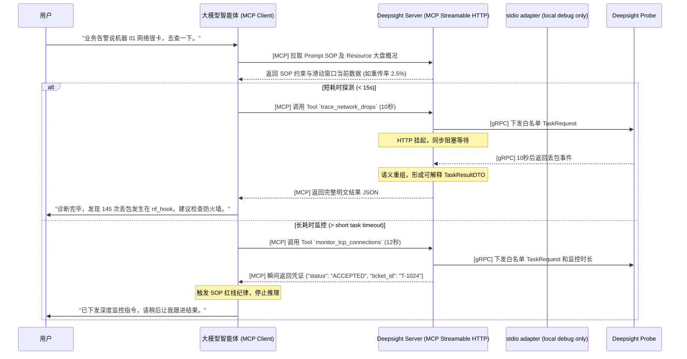

# MCP 集成

在 Deepsight 架构中，底层的 eBPF 探针负责高频采集与安全截断，中间的 gRPC 和 Server 负责语义重组与冷热记忆，而顶层的 MCP（Model Context Protocol）抽象层负责最终的“外交”。当前 MCP user surface 已作为可用入口实现；本文描述当前语义、交互边界和面向 LLM 的使用方式。

大语言模型无法直接解析底层的二进制字节流，也无法直接调用 Go 函数。MCP 层的目标职责，是将 Memory Layer 提供的可解释 QueryDTO 包装为稳定 JSON 协议暴露给大模型。通过 MCP，Deepsight 才能从一个传统监控通道演进为 AI 原生的可观测基础设施。

MCP Layer 遵循 MCP 规范，向外暴露三大核心原语：**Resources（资源）**、**Tools（工具）** 和 **Prompts（提示词模板）**。当前实现坚持轻量级、LLM-first、bounded cost 的设计，不保留旧 B7 空 capability 兼容层，也不实现旧 HTTP+SSE transport。

Deepsight Server 是可信中枢。南向 Probe-facing 流量使用 gRPC over TCP/UDS 和
protobuf，服务高频采集、批量遥测和 TaskChannel 控制流；北向 LLM-facing 流量使用
MCP over Streamable HTTP 和 JSON-RPC，服务 Resources、Tools 和 Prompts。本地
IDE/开发调试可通过独立 `deepsight-mcp-stdio` adapter 接入同一套 Streamable HTTP
MCP 入口；adapter 源码入口位于 `server/cmd/stdio/main.go`。Server 不兼容旧
HTTP+SSE transport。

## MCP Resources（资源）

Resources 是只读的、被动的上下文数据。它们消费 Memory Layer 的查询接口，而不是直接遍历 Server 内部结构；大模型在排查问题的初期，首先拉取这些资源来构建系统的全局静态切片。

网络相关 Resources 的 Metric/Event 来源、聚合边界和下钻入口见[网络模块 gRPC 接入设计](/guide/modules/network-grpc)。
以下 JSON 示例用于说明当前 MCP user surface 的稳定展示方向。具体当前资源名、工具名、错误语义和传输约束以 [Server MCP Layer 设计](/guide/server/mcp) 与当前实现为准。

### 常态统计数据

- **底层数据源**：纯内存时间滑动窗口（Metrics 热数据）
- **示例描述**：返回当前被测主机最近 5 分钟的 TCP 连接状态分布及重传率大盘
- **大模型所见 (JSON 示例)**：

```json
{
  "node_id": "prod-gateway-01",
  "window_start_ns": 1698400500000000000,
  "window_end_ns": 1698400800000000000,
  "generated_at_ns": 1698400800000000000,
  "module": "network",
  "summaries": [
    {
      "kind": "tcp_retransmits",
      "dimensions": {"protocol": "tcp"},
      "temporality": "delta",
      "last": 12,
      "avg": 7,
      "max": 18,
      "sample_count": 60,
      "freshness_sec": 1
    }
  ]
}
```

### 特殊异常消息

- **底层数据源**：冷事件队列或持久化事件存储（Events 冷数据）
- **示例描述**：返回过去 12 小时内，目标机器发生的 `CRITICAL` 级别的突发异常。包含了 Probe 边缘熔断时的截断统计，帮助大模型感知系统风暴。
- **大模型所见 (JSON 示例)**：

```json
{
  "window_start_ns": 1698357600000000000,
  "window_end_ns": 1698400800000000000,
  "generated_at_ns": 1698400800000000000,
  "events": [
    {
      "event_id": "evt-oom-001",
      "node_id": "prod-gateway-01",
      "module": "process",
      "kind": "oom_killed",
      "severity": "critical",
      "first_seen_ns": 1698372933000000000,
      "last_seen_ns": 1698372933000000000,
      "sample_count": 1,
      "truncated_count": 45,
      "cumulative_count": 46,
      "summary": "Process java was killed by OOM; truncated_count indicates an event storm."
    }
  ]
}
```

## MCP Tools（工具）

- Tools 是可执行动作，通过 Server 的 Task manager 和 `TaskChannel` 下发已接受的白名单任务。当大模型通过 Resources 发现疑点后，可以调用 Tools 触发短时诊断窗口。
- **Probe 安全白名单**：Server 通过 `TaskChannel` 只能下发 proto 已接受、Probe 配置白名单允许的任务。Probe 必须拒绝任意 hook/function/BPF 字节码、配置热修改或任何可能修改内存、I/O、网络路径的动作。

网络 Tools 不暴露任意 hook/function，而是暴露 `trace_network_drops`、`trace_tcp_retransmits`、`monitor_tcp_connections` 等白名单任务；候选参数和安全边界见[网络模块 gRPC 接入设计](/guide/modules/network-grpc)。

### 示例工具

为了兼容大模型的请求超时限制并消灭“幻觉等待”，Tools 的返回形态会根据任务要求的持续时间 (`duration_sec`) 智能分流。

- **场景 A：短耗时任务（如 10 秒抽样抓包） -> 同步阻塞返回**
- **功能**：命令 Probe 动态挂载 `kfree_skb` 探针，抓取网络丢包调用栈。
- **参数**：`target_ip`="192.168.1.50", `duration_sec`=10
- **目标交互逻辑**：Server 在 TaskChannel 可用且任务被 Probe 接受后，同步等待短任务结果。10 秒后，大模型收到包含完整证据的 JSON 结果。

```json
{
  "task_id": "tsk-99823",
  "ticket_id": "",
  "node_id": "prod-gateway-01",
  "module": "network",
  "task_type": "trace_network_drops",
  "status": "COMPLETED",
  "created_at_ns": 1698400800000000000,
  "running_at_ns": 1698400801000000000,
  "completed_at_ns": 1698400810000000000,
  "expires_at_ns": 1698404400000000000,
  "error_msg": "",
  "trace_results": [
    {
      "module": "network",
      "kind": "packet_drop",
      "dst_ip": "192.168.1.50",
      "reason_class": "drop",
      "detail": "ip_rcv -> tcp_v4_rcv -> tcp_drop",
      "count": 145,
      "truncated_count": 0
    }
  ],
  "metric_results": [],
  "truncated_count": 0
}
```

- **场景 B：长耗时任务（如 10 秒以上监控窗口） -> 取件码 (Ticket) 凭证返回**
- **功能**：对可疑节点进行一个超过短任务阈值的 TCP 连接状态监控。
- **参数**：`duration_sec`=12
- **目标交互逻辑**：Server 在任务被 Probe 接受后返回受理凭证。大模型收到凭证后停止根因结论，稍后使用 `check_task_result(ticket_id)` 提取最终结果。
- **当前纪律边界**：这一轮采用破坏性收敛，不再维护 pending-ticket 协议阻断；等待阶段依赖 Prompt 纪律和高成本 Tool 并发 gate，而不是额外的会话状态机。

```json
{
  "task_id": "tsk-99824",
  "ticket_id": "T-1024",
  "node_id": "prod-gateway-01",
  "module": "network",
  "task_type": "monitor_tcp_connections",
  "status": "ACCEPTED",
  "created_at_ns": 1698400800000000000,
  "running_at_ns": 0,
  "completed_at_ns": 0,
  "expires_at_ns": 1698404400000000000,
  "error_msg": "",
  "trace_results": [],
  "metric_results": []
}
```

## MCP Prompts（提示词）

大模型在面对极其硬核的 Linux 内核堆栈时，如果没有引导，很容易产生误判。同时，为了驾驭长任务凭证机制和边缘截断机制，Prompts 充当了内置在 Deepsight 中的“人类 SRE 专家纪律”。

当用户对 AI 说：“帮我查一下生产环境的网络卡顿”，客户端会自动拉取以下 Prompt 模板强制约束大模型行为：

### 示例专家模板

```json
你是一个资深的 Linux SRE 内核专家。现在需要诊断目标机器的网络延迟问题。
请严格按照以下 SOP 步骤进行操作：

1. **审视大盘**：强制优先读取 `system://metrics/network` 资源。
2. **逻辑判断**：
   - 如果重传率 < 0.5%，请告知用户网络底层大概率正常，建议排查应用层。
   - 如果重传率 > 0.5% 或存在丢包，进入下一步。
3. **下钻抓包与 ticket 纪律**：
   - 调用 `trace_network_drops` 工具。
   - **【红线纪律】**：如果你收到的 JSON 包含 `ticket_id` 且状态为 `ACCEPTED`，严禁脑补排查结果！你必须立即回复用户：“任务已下达，需等待 X 秒，请稍后让我查询结果”，然后立刻停止输出。
4. **病理解释与灾情评估**：
   - 根据最终返回的 `TaskResultDTO.trace_results[].detail` 纯文本，通俗解释丢包位置（如 `tcp_v4_rcv` 提示半连接队列满）。
   - **【灾情感知纪律】**：如果发现 `truncated_count > 0`，说明底层发生了高频风暴触发了探针熔断。你必须向用户发出严重警告：“系统当前处于大面积雪崩状态，展示的仅为典型截断样本”。
5. **结论输出**：给出最终的修复建议。
```

## 交互序列图

结合资源拉取、短任务同步阻塞以及长任务凭证流转，Deepsight 与大模型的目标自动化排查交互流程如下所示：


