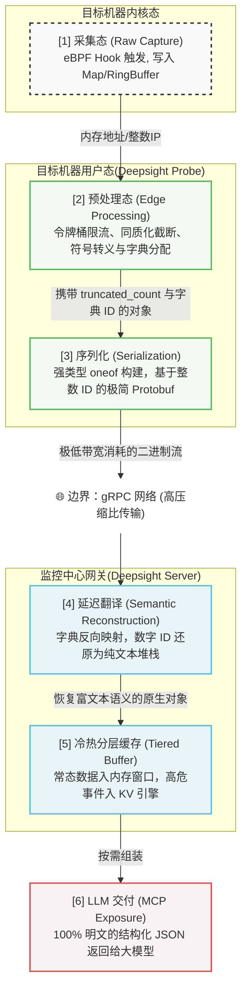

# 数据管线

在传统的监控系统中，数据流通常是简单的“采集 -> 上报 -> 集中存储”，但在 Deepsight 面向 AI 的架构中，我们面临着一个巨大的核心矛盾：底层 eBPF 产生的数据是极其高频、海量且缺乏人类语义的（如内存地址、整数型的 IP），而大语言模型（LLM）需要的是低频、高价值、富含上下文的明文结构化文本。

为了解决这一矛盾，Deepsight 的数据管线严格贯彻了“边缘防线与服务端重组”的策略。我们在探针侧进行严格的熔断限流与高压缩比字典映射以保护物理资源，在网关侧执行延迟翻译与冷热分级缓存，最终为大模型提供 100% 语义透明的数据视图。

## 数据分类

在进入具体阶段前，我们必须明确 Deepsight 中的数据被严格划分为两类语义，它们在整条管线的处理与存储机制上享受完全不同的策略：

| 特性       | Metric（常态遥测指标）                | Event（事件与异常栈）                  |
| ---------- | ------------------------------------- | -------------------------------------- |
| 数据特性   | 高频、连续、体积小                    | 低频、突发、包含丰富上下文（如调用栈） |
| 业务语义   | 系统的背景底噪与健康度快照（"What"）  | 确凿的病理证据与诊断线索（"Why"）      |
| 内核来源   | eBPF Map (通过累加器进行统计)         | eBPF RingBuffer (触发阈值时被动推入)   |
| 缓存机制   | 纯内存 FIFO 数组 (极速读写，无持久化) | 轻量级内嵌 KV 引擎 + 内存防抖去重      |
| 大模型消费 | 构筑 `MCP Resources` (全局静态视图)   | 作为 `MCP Tools` 追踪任务的返回结果    |

## 处理链路

以底层的内核网络协议栈发生丢包为例，从信息采集，到最终大模型消费，数据将经历一条兼顾极限性能与语义完整性的流水线。

### 采集态

- **位置**：内核态 (Probe 的 eBPF 字节码)
- **动作**：当触发特定的挂载点（如网络模块候选的丢包、重传、连接状态变化探针，或存储模块未来的慢 I/O 阈值）时，eBPF 程序会在极短的时间内（纳秒级）将当前的上下文收集起来。网络探针的候选矩阵见[网络模块 Probe 设计](/guide/modules/network-probe)，存储探针路线见[存储模块 Probe 设计](/guide/modules/storage-probe)。
- **数据形态**：极度原始。IP 地址表现为无符号整数（如 `3232235777`），调用栈表现为一堆内存地址的 Stack ID（如 `0xffffffff81745a20`）。
- **设计约束**：内核侧严禁进行复杂的字符串拼接操作，以保证对系统业务零侵入、零卡顿。

### 预处理态

- **位置**：用户态 (Probe 的 Go 业务代码 - `TelemetryTransformer` 模块)
- **动作**：
    1. **边缘限流与同质化截断**：这是保护宿主机的第一道防线。强制启用令牌桶限流器，当系统发生网络风暴或频繁 OOM 时，超限的重复事件会被直接丢弃。Probe 会提取一个典型样本，并在数据结构中附加 `truncated_count`（截断数量），确保以极低的资源消耗向大模型传递大面积雪崩的“灾情”。
    2. **符号化与字典映射**：Probe 在本地查询宿主机的内核符号表（`/proc/kallsyms`），将内存地址翻译成可读的函数调用链（如 `"tcp_v4_rcv -> tcp_drop"`）。为避免长字符串打爆网络带宽，Probe 会为每个新字符串分配一个 `uint32` 的整数 ID，并将增量字典与数据包一同准备。
    3. **格式转换**：将整数形态的 IP 转换回标准的 IPv4/IPv6 字符串。
- **数据形态**：完成降维截断，且核心长字符串已替换为整型 ID 的 Go Struct。

### 序列化

- **位置**：Probe 端的 `TelemetryExporter` 模块
- **动作**：调用 gRPC 客户端接口发送数据。底层的 Protobuf 引擎介入，利用强类型的 `oneof` 联合体严格区分不同的业务载荷（如网络、存储），并将带有整数 ID 的 Go Struct 瞬间压缩。
- **数据形态**：类型明确且高压缩比的 Protobuf 二进制字节流，完全规避了重复长文本的冗余传输。

### 反序列化与语义重组 (延迟翻译)

- **位置**：物理网络 / Server 端的 `TelemetryIngester` 模块
- **动作**：二进制流跨越网络抵达 Server。gRPC 引擎将其还原后，Server 内部的工作协程立即利用维护好的全量字典，执行“延迟翻译”。它将包内的 `uint32` 数字 ID 反向映射回完整的纯文本字符串。
- **数据形态**：彻底告别晦涩的 ID 编码，重新恢复为包含丰富上下文的、大模型能够直接阅读的 Server 侧内存原生明文对象。

### 摄入与冷热分层缓存

- **位置**：Server 端的 `Memory Buffer` 引擎
- **动作**：
  - **Metrics 流**：直接推入纯内存的时间滑动窗口（定长 FIFO 数组），接受服务重启带来的数据挥发，确保极致的响应速度。
  - **Events 流**：存入前进行“基于指纹的防抖去重（Debouncing）”。若 1 分钟内收到相同的内核栈样本，仅更新 `cumulative_count` 与时间戳；新事件则通过内存映射（mmap）技术实时追加到轻量级内嵌 KV 引擎（如 bbolt / BadgerDB）中，确保网关重启后“案发现场”依然可被大模型回溯。
- **数据形态**：被安全且高效分类存储的结构化系统病历本。

### 大模型交付

- **位置**：Server 端 MCP 协议栈
- **动作**：当大模型通过 MCP 协议发起主动询问时，Server 从上述冷热缓存中提取出最新的明文对象，格式化为大模型要求的 JSON 文本。若检测到 `truncated_count > 0`，大模型结合专用的 Prompt 提示词，能够精准推理出系统当前正处于高频风暴之中。
- **数据形态**：符合标准 Schema 的 100% 结构化明文 JSON。

## 更多

了解了数据在数据链路中是如何处理并实现网络压缩与语义透明的解耦之后，我们需要定义具体的传输接口规则：

👉 [RPC 核心通信契约](/guide/rpc-contract)
