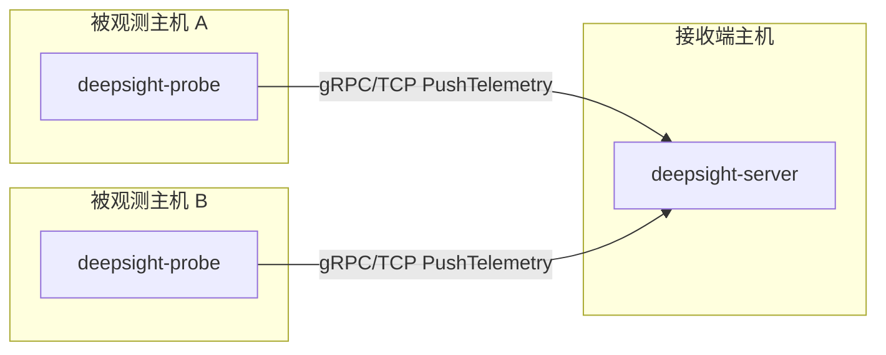
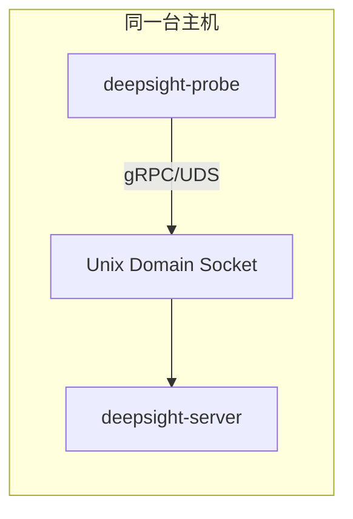

# 安装 Deepsight

> 本文面向 Deepsight 用户，说明如何获取、安装和启动 Deepsight Server 与 Deepsight Probe。
> 配置项说明见[用户配置说明](/guide/config)，手工前台调试见[手工运行与前台调试](/guide/use/manual-run)。

首次使用时，建议先按目标选择入口：

- 只想先把 Claude Code 接到 Deepsight MCP：看[LLM 快速接入](/guide/use/llm-quick-start)
- 想在同一台机器上跑通 Server + Probe + MCP + Task：看[单机完整演示](/guide/use/single-node-demo)
- Server 与 Probe 不在同一台机器：看[分布式部署](/guide/use/distributed-deploy)

默认用户路径是使用同版本 release 包安装。
本文只覆盖 release 包安装与运行。

---

## 一、组件与部署模式

Deepsight 由两个运行组件组成：

- `deepsight-server`：gRPC 接收端，接收 Probe 上报的遥测数据。
- `deepsight-probe`：部署在被观测主机上的采集端，加载 eBPF 程序并主动连接 Server。

Probe 和 Server 是同一 Deepsight release 的配套组件，但运行和发布产物分离。必须同版本配套使用，避免 proto/gRPC 契约快速演进阶段出现字段或语义不一致。当前 TaskChannel 契约已经完成 lockstep breaking replacement，不支持旧 stream shape 混用，也不支持混合版本 Probe/Server。

### 1.1 TCP 分布式部署



TCP 是跨机器部署的默认模式。Server 监听一个 TCP 地址，Probe 通过
`probe.exporter.endpoint` 主动连接 Server。跨机器部署时，需要把 Server
监听地址和 Probe endpoint 改成内网可达地址。当前 TLS/mTLS 尚未实现，不应直接暴露到公网。

### 1.2 UDS 单机部署



UDS 适合 Probe 与 Server 在同一台机器运行的场景，例如本机试用、开发验证或低网络暴露面的单机部署。Server 创建 Unix socket，Probe 连接同一路径。

release 安装中的 `single-node-demo` preset 默认使用：

- `server.listen.network=unix`
- `server.listen.address=/run/deepsight/grpc.sock`
- `probe.exporter.endpoint.network=unix`
- `probe.exporter.endpoint.address=/run/deepsight/grpc.sock`
- `server.mcp.listen.address=127.0.0.1:50052`

---

## 二、系统要求

Server：

- Linux 用户态服务
- 能监听 TCP 地址或 Unix socket
- 当前 TLS/mTLS 未实现，`tls.enabled` 必须保持 `false`

Probe：

- Linux kernel >= 5.x
- cgroup v2
- BTF 可用，通常应存在 `/sys/kernel/btf/vmlinux`
- root 或足够的 eBPF capability，用于加载和 attach eBPF 程序
- 能访问 Server 的 TCP 地址或 Unix socket 路径

检查 BTF：

```bash
ls -la /sys/kernel/btf/vmlinux
```

---

## 三、安装方式

### 3.1 推荐：使用 release 包安装

Deepsight Probe 采用 CO-RE eBPF 方式，发布目标是预构建二进制。CO-RE 不要求用户在目标机器上从源代码构建；构建方可以提前把 eBPF object 编进 Probe 二进制，用户运行时只需要满足现代内核、BTF、cgroup v2 和 eBPF 权限要求。

推荐从 Deepsight 发布页下载同一版本的 release 包：

- `deepsight-linux-amd64-v0.2.0.tar.gz`
- `deepsight-linux-amd64-v0.2.0.tar.gz.sha256`

下载后校验 checksum：

```bash
sha256sum -c deepsight-linux-amd64-v0.2.0.tar.gz.sha256
```

解包：

```bash
tar -xzf deepsight-linux-amd64-v0.2.0.tar.gz
cd deepsight-linux-amd64-v0.2.0
sha256sum -c checksums.txt
```

安装二进制：

```bash
sudo install -m 0755 bin/deepsight-server /usr/local/bin/deepsight-server
sudo install -m 0755 bin/deepsight-probe /usr/local/bin/deepsight-probe
sudo install -m 0755 bin/deepsight-mcp-stdio /usr/local/bin/deepsight-mcp-stdio
```

其中 `deepsight-mcp-stdio` 是本地 IDE/开发调试用的独立 MCP stdio adapter，
桥接到 Server 的 MCP Streamable HTTP 入口；不使用 stdio MCP client 时可以先不安装。

如果你想避免手工复制二进制、配置和 systemd unit，release 包现在提供基于 preset 的一键安装脚本：

```bash
sudo ./install.sh --preset llm-quickstart
```

它会自动：

- 按场景选择 `server` / `probe` / `server+probe`
- 安装对应的 preset 配置到 `/etc/deepsight/`
- 安装 `deepsight-init-client`
- 把 `buffer.event_store_path` 改成 `/var/lib/deepsight/deepsight-events.db`
- 安装 systemd unit 到 `/etc/systemd/system/`
- 对 `--role all` / `--role server` 自动创建 `deepsight` 系统用户/组，并让 `deepsight-server` 以该非 root 账号运行
- 按需要启用并启动 `deepsight-server` / `deepsight-probe`

preset 建议：

- LLM 首次接入：`sudo ./install.sh --preset llm-quickstart`
- 单机完整演示：`sudo ./install.sh --preset single-node-demo`
- 接收端主机：`sudo ./install.sh --preset split-server --server-address &lt;server-ip&gt;:50051`
- 被观测主机：`sudo ./install.sh --preset split-probe --probe-address &lt;server-ip&gt;:50051`

如果是跨机器部署，可显式覆盖地址：

```bash
sudo ./install.sh \
  --preset split-probe \
  --probe-address 10.0.0.10:50051
```

权限边界：

- `deepsight-server` 是纯用户态服务，标准 systemd 安装会以 `deepsight` 非 root 用户运行。
- `deepsight-probe` 仍需要 root 或等价 eBPF capability 来加载/attach eBPF 程序，因此当前继续以 root 运行。

`install.sh` 是当前面向普通用户和交付场景的主安装入口。
它假定输入已经是一个完整 release 包，而不是源码目录。

如果你是在源码仓库里验证本地构建产物，不要使用本文的 release 入口；
改看[从源码构建并安装运行时](/guide/dev/install-from-source)。

## 四、启动顺序

1. 启动 `deepsight-server`
2. 启动 `deepsight-probe`
3. 检查 Server 日志中是否出现 Probe register
4. 检查 Probe 日志中是否出现 gRPC stream established
5. 检查 Server 是否持续收到 `PushTelemetry` batch

注意，如果你手工关闭了 `server.task_channel.enabled`，Server 会对 TaskChannel
返回 `Unimplemented`。Probe 会记录 warning，并继续运行数据面上报，这不是安装失败；
显式启用后当前已接入 hello-gated control plane、TaskState/ticket 和 MCP Tool/result
query 闭环。

---

## 五、当前限制

- TLS/mTLS 尚未实现，所有配置中的 `tls.enabled` 必须为 `false`。
- Server MCP/LLM 用户入口已经实现；当前仓库与 release 提供的 example 配置默认已打开，主路径使用 Streamable HTTP，本地 IDE/开发调试可使用独立 `deepsight-mcp-stdio` adapter。如果你不希望暴露控制面或 MCP 入口，可以在部署前手工关闭。
- 仓库的 example 配置为了 LLM/MCP 全功能演示与验收，默认三模块全开，并已打开 MCP 与 TaskChannel；如果你只想做最小采集或不需要控制面 / MCP 暴露，可以在部署前手工关闭相应模块或开关。
- `completion/complete`、resource subscription 和 `logging/setLevel` 当前未实现，调用时会返回结构化 feature-disabled 错误。
- Pod/Container 归因是 best-effort；没有容器或 Kubernetes cgroup identity 的主机上相关字段可能为空。
- Probe 的真实 eBPF attach 依赖目标主机内核、BTF、cgroup v2 和权限环境。
