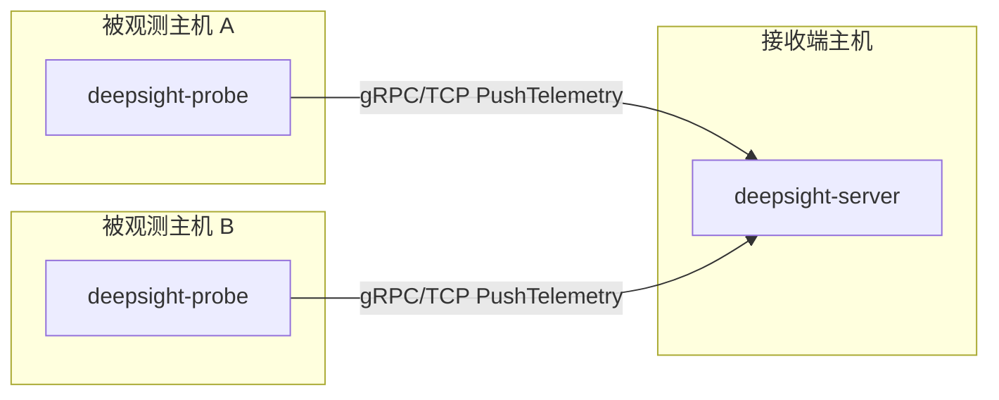
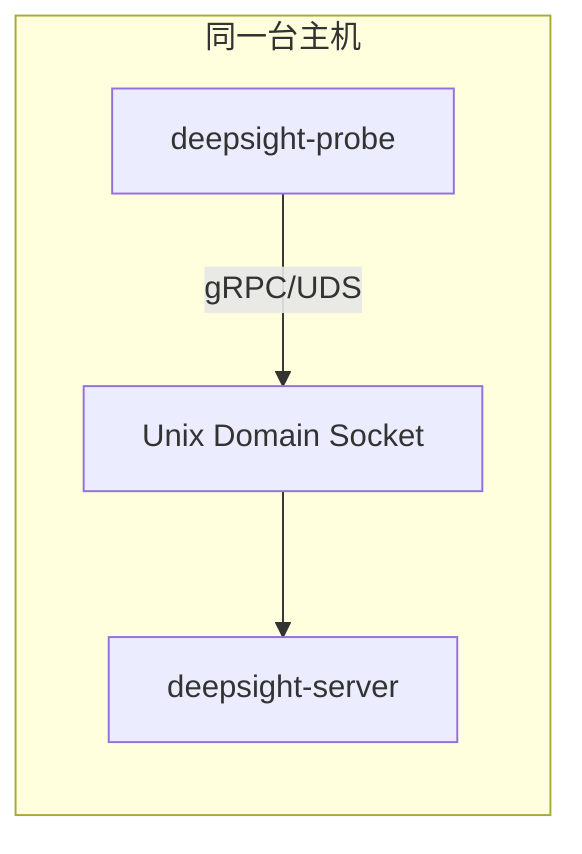

# 安装 Deepsight

> 本文面向 Deepsight 用户，说明如何获取、安装和启动 Deepsight Server 与 Deepsight Probe。
> 开发环境搭建见[一键部署](/guide/quick-start)，配置项说明见[用户配置说明](/guide/config)。

---

## 一、组件与部署模式

Deepsight 由两个运行组件组成：

- `deepsight-server`：gRPC 接收端，接收 Probe 上报的遥测数据。
- `deepsight-probe`：部署在被观测主机上的采集端，加载 eBPF 程序并主动连接 Server。

Probe 和 Server 是同一 Deepsight release 的配套组件，但运行和发布产物分离。推荐同版本配套使用，避免 proto/gRPC 契约快速演进阶段出现字段或语义不一致。

### 1.1 TCP 分布式部署



TCP 是跨机器部署的默认模式。Server 监听一个 TCP 地址，Probe 通过
`probe.exporter.endpoint` 主动连接 Server。

当前示例配置默认使用 `127.0.0.1:50051`，只适合本机验证。跨机器部署时，需要把 Server 监听地址和 Probe endpoint 改成内网可达地址。当前 TLS/mTLS 尚未实现，不应直接暴露到公网。

### 1.2 UDS 单机部署



UDS 适合 Probe 与 Server 在同一台机器运行的场景，例如本机试用、开发验证或低网络暴露面的单机部署。Server 创建 Unix socket，Probe 连接同一路径。

---

## 二、系统要求

Server：

- Linux 用户态服务
- 能监听 TCP 地址或 Unix socket
- 当前 TLS/mTLS 未实现，`tls.enabled` 必须保持 `false`

Probe：

- Linux kernel >= 5.x
- cgroup v2
- BTF 可用，通常应存在 `/sys/kernel/btf/vmlinux`
- root 或足够的 eBPF capability，用于加载和 attach eBPF 程序
- 能访问 Server 的 TCP 地址或 Unix socket 路径

检查 BTF：

```bash
ls -la /sys/kernel/btf/vmlinux
```

---

## 三、安装方式

### 3.1 预构建二进制

Deepsight Probe 采用 CO-RE eBPF 方式，发布目标是预构建二进制。CO-RE 不要求用户在目标机器上从源代码构建；构建方可以提前把 eBPF object 编进 Probe 二进制，用户运行时只需要满足现代内核、BTF、cgroup v2 和 eBPF 权限要求。

推荐从 Deepsight 发布页下载同一版本的 release 包：

- `deepsight-linux-amd64-v0.1.0.tar.gz`
- `deepsight-linux-amd64-v0.1.0.tar.gz.sha256`

下载后校验 checksum：

```bash
sha256sum -c deepsight-linux-amd64-v0.1.0.tar.gz.sha256
```

解包：

```bash
tar -xzf deepsight-linux-amd64-v0.1.0.tar.gz
cd deepsight-linux-amd64-v0.1.0
sha256sum -c checksums.txt
```

安装二进制：

```bash
sudo install -m 0755 bin/deepsight-server /usr/local/bin/deepsight-server
sudo install -m 0755 bin/deepsight-probe /usr/local/bin/deepsight-probe
```

如果 release 包尚未提供，请使用源码构建方式。

### 3.2 从源码构建

源码构建适合开发者、内部验证或 release pipeline 尚未提供二进制时使用。

先按[一键部署](/guide/quick-start)准备开发环境，然后在仓库根目录执行：

```bash
. scripts/dev/env.sh
make build
```

构建产物：

```text
build/deepsight-server
build/deepsight-probe
```

也可以安装到 `/usr/local/bin`：

```bash
. scripts/dev/env.sh
make install
```

---

## 四、启动 Server

准备 Server 配置文件，可以从 release 包或源码模板复制：

```bash
cp configs/server.example.yaml server.yaml
```

TCP 本机验证时可以保持默认：

```yaml
server:
  listen:
    network: tcp
    address: 127.0.0.1:50051
    tls:
      enabled: false
```

前台启动，适合首次验证：

```bash
deepsight-server --config server.yaml
```

如果使用源码构建产物：

```bash
./build/deepsight-server --config server.yaml
```

生产或长期运行时，建议交给 systemd 等进程管理器常驻运行。示例 unit：

```ini
[Unit]
Description=Deepsight Server
After=network-online.target
Wants=network-online.target

[Service]
Type=simple
ExecStart=/usr/local/bin/deepsight-server --config /etc/deepsight/server.yaml
Restart=on-failure
RestartSec=5s

[Install]
WantedBy=multi-user.target
```

启用：

如果当前目录是 release 包解包目录：

```bash
sudo install -d /etc/deepsight
sudo install -m 0644 server.yaml /etc/deepsight/server.yaml
sudo install -m 0644 systemd/deepsight-server.service /etc/systemd/system/deepsight-server.service
sudo systemctl daemon-reload
sudo systemctl enable --now deepsight-server
```

如果当前目录是源码目录：

```bash
sudo install -d /etc/deepsight
sudo install -m 0644 server.yaml /etc/deepsight/server.yaml
sudo install -m 0644 deploy/systemd/deepsight-server.service /etc/systemd/system/deepsight-server.service
sudo systemctl daemon-reload
sudo systemctl enable --now deepsight-server
```

---

## 五、启动 Probe

准备 Probe 配置文件，可以从 release 包或源码模板复制：

```bash
cp configs/probe.example.yaml probe.yaml
```

TCP 本机验证时可以保持默认：

```yaml
probe:
  exporter:
    endpoint:
      network: tcp
      address: 127.0.0.1:50051
      tls:
        enabled: false
```

Probe 需要 eBPF 权限，通常以 root 启动。前台启动适合首次验证：

```bash
sudo deepsight-probe --config probe.yaml
```

如果使用源码构建产物：

```bash
sudo ./build/deepsight-probe --config probe.yaml
```

生产或长期运行时，建议交给 systemd 常驻运行。示例 unit：

```ini
[Unit]
Description=Deepsight Probe
After=network-online.target
Wants=network-online.target

[Service]
Type=simple
ExecStart=/usr/local/bin/deepsight-probe --config /etc/deepsight/probe.yaml
Restart=on-failure
RestartSec=5s

[Install]
WantedBy=multi-user.target
```

启用：

如果当前目录是 release 包解包目录：

```bash
sudo install -d /etc/deepsight
sudo install -m 0644 probe.yaml /etc/deepsight/probe.yaml
sudo install -m 0644 systemd/deepsight-probe.service /etc/systemd/system/deepsight-probe.service
sudo systemctl daemon-reload
sudo systemctl enable --now deepsight-probe
```

如果当前目录是源码目录：

```bash
sudo install -d /etc/deepsight
sudo install -m 0644 probe.yaml /etc/deepsight/probe.yaml
sudo install -m 0644 deploy/systemd/deepsight-probe.service /etc/systemd/system/deepsight-probe.service
sudo systemctl daemon-reload
sudo systemctl enable --now deepsight-probe
```

---

## 六、启动顺序

1. 启动 `deepsight-server`
2. 启动 `deepsight-probe`
3. 检查 Server 日志中是否出现 Probe register
4. 检查 Probe 日志中是否出现 gRPC stream established
5. 检查 Server 是否持续收到 `PushTelemetry` batch

注意，当前 Bob-owned Server 的 `TaskChannel` 仍可能返回 `Unimplemented`。Probe 会记录 warning，并继续运行数据面上报，这不是安装失败。

---

## 七、当前限制

- TLS/mTLS 尚未实现，所有配置中的 `tls.enabled` 必须为 `false`。
- Server TaskChannel 当前未完成；Probe 侧 executor 已实现，但完整控制面需要 Bob-owned Server 后续接入。
- LLM/MCP 用户入口不属于当前安装文档范围，待 Bob-owned MCP/Tool 能力完成后补充。
- Pod/Container 归因是 best-effort；没有容器或 Kubernetes cgroup identity 的主机上相关字段可能为空。
- Probe 的真实 eBPF attach 依赖目标主机内核、BTF、cgroup v2 和权限环境。
