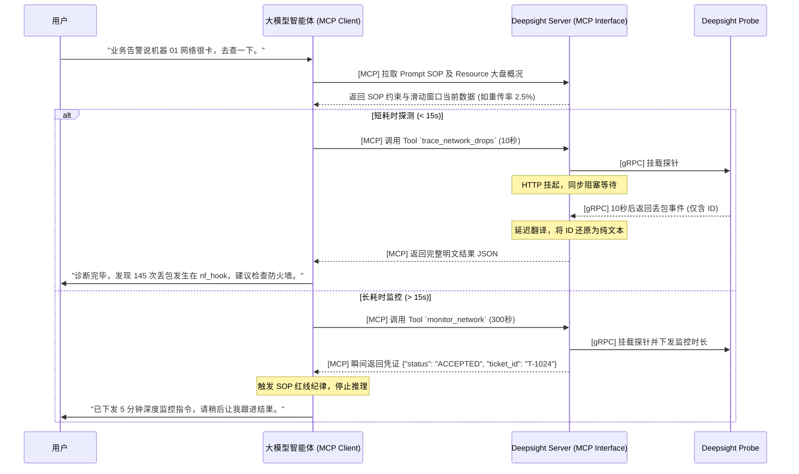

# MCP 集成

在 Deepsight 架构中，底层的 eBPF 探针负责高频采集与安全截断，中间的 gRPC 和 Server 负责压缩解包、语义重组与冷热缓存，而顶层的 MCP（Model Context Protocol）抽象层则负责最终的“外交”。

大语言模型（如 Claude, GPT-4）无法直接解析底层的二进制字节流，也无法直接调用 Go 函数。MCP 层的唯一职责，就是将 Server 端内存中已被“延迟翻译”还原为 100% 明文的系统状态，包装为标准化的 JSON 协议暴露给大模型。通过 MCP，Deepsight 真正从一个“传统的监控系统”蜕变成了一个“AI 原生的可观测基础设施”。

Deepsight 严格遵循 MCP 规范，向外暴露三大核心原语：**Resources（资源）**、**Tools（工具）** 和 **Prompts（提示词模板）**。

## MCP Resources（资源）

Resources 是只读的、被动的上下文数据，它直接对接 Server 内存中的“纯内存时间滑动窗口”和“持久化事件队列”，大模型在排查问题的初期，首先会拉取这些资源来构建系统的全局静态切片。

### 常态统计数据

- **底层数据源**：纯内存时间滑动窗口（Metrics 热数据）
- **示例描述**：返回当前被测主机最近 5 分钟的 TCP 连接状态分布及重传率大盘
- **大模型所见 (JSON 示例)**：

```json
{
  "node_id": "prod-gateway-01",
  "timestamp_utc": "2023-10-27T10:00:00Z",
  "window_duration_minutes": 5,
  "metrics": {
    "tcp_retransmit_rate_pct": 1.2,
    "active_connections": 15420,
    "dropped_packets_per_sec": 12
  }
}
```

### 特殊异常消息

- **底层数据源**：内嵌 KV 引擎持久化的防抖事件队列（Events 冷数据）
- **示例描述**：返回过去 12 小时内，目标机器发生的 `CRITICAL` 级别的突发异常。包含了 Probe 边缘熔断时的截断统计，帮助大模型感知系统风暴。
- **大模型所见 (JSON 示例)**：

```json
{
  "total_critical_events": 1,
  "events": [
    {
      "time": "2023-10-27T02:15:33Z",
      "type": "OOM_KILLER_INVOKED",
      "details": "Process 'java' (PID 8832) was killed due to out of memory.",
      "truncated_count": 45  // 提示大模型：底层发生了风暴，另有 45 次同质化事件被边缘探针熔断截留
    }
  ]
}
```

## MCP Tools（工具）

- Tools 是可执行的动作，它直接对接 Server 的“控制面 TaskChannel”与“长短任务智能状态机”。当大模型通过 Resources 发现疑点后，会调用 Tools 向底层 Probe 动态下发 eBPF 探针进行下钻排查。
- **硬编码探针安全白名单**：针对 Server 通过 `TaskChannel` 直接下发 eBPF 指令带来的“高低权限倒挂”风险，Probe 内部必须硬编码“安全操作白名单”。仅允许挂载只读型探针（如 Kprobe/Tracepoint），从物理源头拒绝任何可能修改内存或阻断网络的指令，防御大模型幻觉带来的 DoS 风险。

### 示例工具

为了完美兼容大模型的请求超时限制并消灭“幻觉等待”，Tools 的返回形态会根据任务要求的持续时间 (`duration_sec`) 智能分流：

- **场景 A：短耗时任务（如 10 秒抽样抓包） -> 同步阻塞返回**
- **功能**：命令 Probe 动态挂载 `kfree_skb` 探针，抓取网络丢包调用栈。
- **参数**：`target_ip`="192.168.1.50", `duration_sec`=10
- **底层与大模型交互逻辑**：Server 直接挂起 HTTP/MCP 请求，阻塞等待 eBPF 采集完毕。10 秒后，大模型一气呵成地收到包含完整堆栈明文的 JSON 结果。

```json
{
  "task_id": "tsk-99823",
  "status": "COMPLETED",
  "findings": [
    {
      "source": "192.168.1.50",
      "kernel_stack_trace": "ip_rcv -> tcp_v4_rcv -> tcp_drop",
      "drop_reason": "TCP_DROP_REASON_NO_SOCKET",
      "occurrence_count": 145,
      "truncated_count": 0
    }
  ]
}
```

- **场景 B：长耗时任务（如 5 分钟长期监控） -> 取件码 (Ticket) 凭证返回**
- **功能**：对可疑进程进行长达 5 分钟的慢 I/O 深度监控。
- **参数**：`pid`="8832", `duration_sec`=300
- **底层与大模型交互逻辑**：Server 立即下发指令并瞬间返回受理凭证。大模型收到凭证后主动结束当前对话，待超时后使用特定的 Tool 提取最终结果。
- **MCP 协议层硬性阻断**：当大模型下发长任务并获得 `ticket_id` 后，不再仅靠 Prompt 的【红线纪律】防止其脑补。Server 应在 MCP 会话层动态屏蔽其他下钻 Tools，强制大模型在等待期间只能调用 `check_task_result(ticket_id)`，用协议层的 HTTP 400 错误强行纠正幻觉

```json
{
  "task_id": "tsk-99824",
  "status": "ACCEPTED",
  "ticket_id": "T-1024",
  "eta_seconds": 300,
  "message": "Task dispatched. Please use check_task_result(ticket_id) after 300s."
}
```

## MCP Prompts（提示词）

大模型在面对极其硬核的 Linux 内核堆栈时，如果没有引导，很容易产生误判。同时，为了驾驭长任务凭证机制和边缘截断机制，Prompts 充当了内置在 Deepsight 中的“人类 SRE 专家纪律”。

当用户对 AI 说：“帮我查一下生产环境的网络卡顿”，客户端会自动拉取以下 Prompt 模板强制约束大模型行为：

### 示例专家模板

```json
你是一个资深的 Linux SRE 内核专家。现在需要诊断目标机器的网络延迟问题。
请严格按照以下 SOP 步骤进行操作：

1. **审视大盘**：强制优先读取 `system://metrics/network/summary` 资源。
2. **逻辑判断**：
   - 如果重传率 < 0.5%，请告知用户网络底层大概率正常，建议排查应用层。
   - 如果重传率 > 0.5% 或存在丢包，进入下一步。
3. **下钻抓包与状态机纪律**：
   - 调用 `trace_network_drops` 工具。
   - **【红线纪律】**：如果你收到的 JSON 包含 `ticket_id` 且状态为 `ACCEPTED`，严禁脑补排查结果！你必须立即回复用户：“任务已下达，需等待 X 秒，请稍后让我查询结果”，然后立刻停止输出。
4. **病理解释与灾情评估**：
   - 根据最终返回的 `kernel_stack_trace` 纯文本，通俗解释丢包位置（如 `tcp_v4_rcv` 提示半连接队列满）。
   - **【灾情感知纪律】**：如果发现 `truncated_count > 0`，说明底层发生了高频风暴触发了探针熔断。你必须向用户发出严重警告：“系统当前处于大面积雪崩状态，展示的仅为典型截断样本”。
5. **结论输出**：给出最终的修复建议。
```

## 交互序列图

结合资源拉取、短任务同步阻塞以及长任务凭证流转，Deepsight 与大模型的自动化排查交互全流程如下所示：


