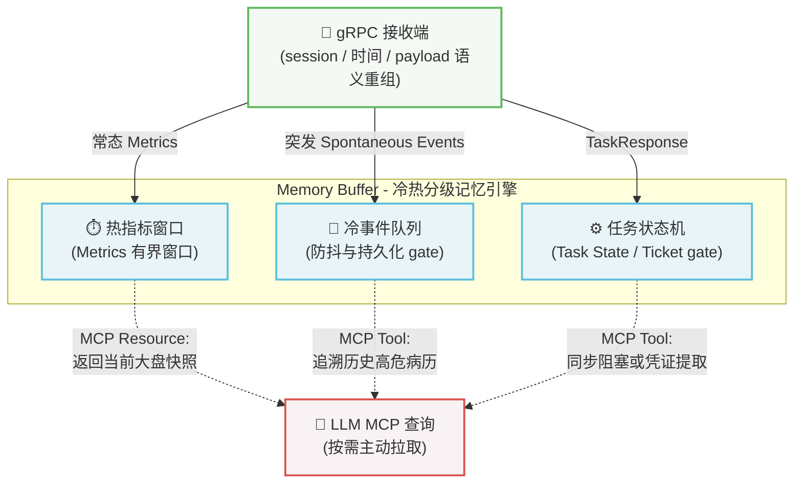

# Server 状态

在 Deepsight 的架构中，存在一个极具挑战性的物理现实：

- **数据生产者（Probe 探针）**：是“川流不息”的，它每秒都在推送 CPU 负载、TCP 重传率等指标，一旦发生断网或 OOM 等异常，也会瞬间上报。
- **数据消费者（大语言模型 LLM）**：是“按需唤醒”且“无状态”的，大模型本质上是一个函数（输入 Prompt，输出文本），它不可能 24 小时保持阻塞状态去监听底层数据的变化。运维人员可能在故障发生两小时后，才唤醒大模型进行排查。

如果 Server 端只是一个单纯的数据透传代理，大模型将永远错过故障发生的“第一现场”。为了化解这种生产与消费的时差，Deepsight Server 的目标是引入核心的缓存与记忆机制 (Memory Buffer)。通过冷热分级记忆、冷事件持久化 gate 和智能任务调度策略，赋予大模型稳定穿越时间的“感知能力”。当前具体实现状态以 `.agent/state/context.md` 为入口。

## 缓冲与记忆架构

当二进制的 `TelemetryBatch` 和 `TaskResponse` 从 gRPC 通道抵达 Server 后，先完成 session、时间、payload 和字典语义重组，再把可解释对象分发到三个相互独立的状态引擎中：

### 纯内存时间滑动窗口 (热数据)

- **应对数据**：来自于 `PushTelemetry` 通道的 `metrics`（常态遥测指标，如 CPU、流量等趋势底噪）
- **核心痛点**：这类数据时效性极强且价值密度低，如果写入数据库将产生毫无意义的极高 I/O 成本。
- **运作机制**：
  - Server 目标上为每个 NodeID 维护固定时间跨度（如最近 5 分钟）的有界窗口。
  - 采用可测试的淘汰策略，接受短时 Metric 数据挥发，以换取快速读写性能。
- **赋能大模型**：当大模型读取指标 Resource 时，Server 将窗口数据聚合为结构化摘要返回。

### 持久化事件队列与防抖 (冷数据)

- **应对数据**：来自于 `PushTelemetry` 通道中夹带的 `spontaneous_events`（突发异常，如内核 OOM、断流警告）
- **核心痛点**：高危事件发生时间不可预测，且大模型往往滞后介入，必须确保“案发现场”不因 Server 意外重启而丢失；同时需防范异常风暴撑爆本地存储。
- **运作机制**：
  - **基于指纹的防抖 (Debouncing)**：在进入冷事件队列前，Server 计算事件指纹。如果窗口内收到相同事件，不创建无限新记录，而是更新已有事件的 `last_seen_time`、`sample_count` 和 `cumulative_count`。
  - **持久化边界**：冷事件目标上可以使用轻量嵌入式 KV 或 append-only store 保存明文事件；具体引擎选择属于后续 Server 实现 gate。
- **赋能大模型**：大模型可以通过冷事件 Resource（如 `system://events/recent`）利用时间索引从本地磁盘极速捞取历史事件，精准复盘故障链。
- **存储逻辑**：明文自包含属性，为化解生产与消费的时差，Server 在持久化 Events 时遵循“先语义重组、后落盘”的原则
  - **语义重组**：Telemetry 批次进入 Memory 前应完成 session、时间、payload 和字典语义重组
  - **数据自包含**：持久化事件必须是可独立解释的结构化对象，不能依赖已经丢失的 session 字典
- **架构收益**：
  - **无状态字典管理**：Server 无需在磁盘上维护复杂的字典版本树
  - **跨会话防抖**：即使 Probe 重启导致 ID 变化，只要内核栈的明文特征一致，Server 依然能准确执行跨会话的事件去重

### 长短任务智能状态机

- **应对数据**：来自于 `TaskChannel` 双向流的下钻排查指令和 Probe 返回的 `TaskResponse`。
- **核心痛点**：大模型的 HTTP 请求受限于严格的超时阈值（通常为 30 秒）。过早异步返回会导致大模型产生“幻觉”脑补结果，过长阻塞则会导致连接崩溃。
- **目标机制**（基于耗时智能分流）：
    1. **短耗时任务（< 15秒，如抽样抓包）**：Server 在 TaskChannel 可用、stream/session 校验通过且任务已被 Probe 接受后，可以同步等待 `TaskResponse` 并返回完整结果。
    2. **长耗时任务（> 15秒，如长期监控）**：Server 在任务被接受后返回取件码 (Ticket)，并要求大模型稍后使用 `check_task_result(ticket_id)` 工具提取闭环结果。

当前 TaskChannel、TaskState 和 ticket manager 已完成当前基线闭环；MCP Tool 可展示 `ACCEPTED + ticket_id` 语义，但大模型仍必须遵守 Prompt 纪律，在 `check_task_result(ticket_id)` 返回终态前不得脑补结论。

## 安全与兜底设计

作为一个 7x24 小时运行的中枢网关，Server 必须在代码层面施加严格的兜底策略：

- **硬性容量上限**：滑动窗口、冷事件队列、持久化存储、任务队列和 ticket 都必须设置严格上限、轮转策略与 TTL。
- **内存水位保护**：当 Server 自身内存水位、事件队列或任务队列超过上限时，应优先拒绝新 Task、限制 MCP 查询、丢弃或降采样低价值 Metric 并记录丢弃计数。`TelemetryAck.pause_sending` 是已保留的背压字段，但当前 Probe exporter 尚未消费该字段，不能把 ack 降频视为已生效能力。
- **僵尸任务回收**：TaskState / Ticket gate 必须定义 GC 规则，定期清理超过生命周期的长任务凭证，防止状态机内存泄漏。

## 更多

Deepsight Server 的目标是通过 **冷热分级缓存、防抖机制与长短任务分流策略**，在“川流不息”的客观物理世界与“断续思考、易产生幻觉”的 AI 推理逻辑之间搭建稳定桥梁。

在完成从内核到缓存的基础设施后，下一层需要面对大模型，定义该暴露哪些受控诊断入口

👉 [MCP 交互接口](/guide/mcp-integration)；Bob-owned Server 细化设计见 [Server 端设计](/guide/server/server)
