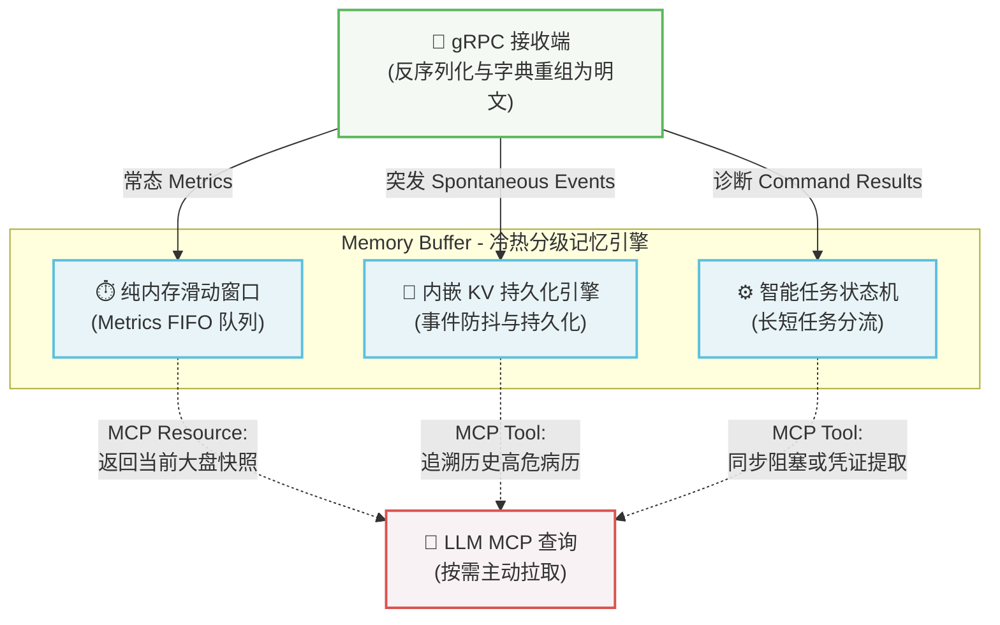

# Server 状态

在 Deepsight 的架构中，存在一个极具挑战性的物理现实：

- **数据生产者（Probe 探针）**：是“川流不息”的，它每秒都在推送 CPU 负载、TCP 重传率等指标，一旦发生断网或 OOM 等异常，也会瞬间上报。
- **数据消费者（大语言模型 LLM）**：是“按需唤醒”且“无状态”的，大模型本质上是一个函数（输入 Prompt，输出文本），它不可能 24 小时保持阻塞状态去监听底层数据的变化。运维人员可能在故障发生两小时后，才唤醒大模型进行排查。

如果 Server 端只是一个单纯的数据透传代理，大模型将永远错过故障发生的“第一现场”。为了化解这种生产与消费的时差，Deepsight Server 引入了核心的缓存与记忆机制 (Memory Buffer)。通过在内存与本地磁盘间构建“冷热分级”的记忆引擎，并配合智能的任务调度策略，赋予了大模型稳定穿越时间的“感知能力”。

## 缓冲与记忆架构

当二进制的 `TelemetryBatch` 和 `TaskResponse` 从 gRPC 通道抵达 Server，并完成反序列化与字典“延迟翻译”后，带有明文语义的数据会被分发到三个相互独立的状态引擎中：

### 纯内存时间滑动窗口 (热数据)

- **应对数据**：来自于 `PushTelemetry` 通道的 `metrics`（常态遥测指标，如 CPU、流量等趋势底噪）
- **核心痛点**：这类数据时效性极强且价值密度低，如果写入数据库将产生毫无意义的极高 I/O 成本。
- **运作机制**：
  - Server 在内存中为每个 NodeID 维护一个固定时间跨度（如最近 5 分钟）的定长数组。
  - 采用严格的 FIFO（先进先出）策略，完全舍弃持久化，主动接受网关重启带来的短时数据挥发，以换取极速的读写性能。
- **赋能大模型**：当大模型调用 `get_system_metrics` 获取当前概况时，Server 直接将当前滑动窗口的数据“冻结”并合并为一个结构化 JSON 返回，实现零延迟读取。

### 持久化事件队列与防抖 (冷数据)

- **应对数据**：来自于 `PushTelemetry` 通道中夹带的 `spontaneous_events`（突发异常，如内核 OOM、断流警告）
- **核心痛点**：高危事件发生时间不可预测，且大模型往往滞后介入，必须确保“案发现场”不因 Server 意外重启而丢失；同时需防范异常风暴撑爆本地存储。
- **运作机制**：
  - **基于指纹的防抖 (Debouncing)**：在存入队列前，Server 会计算内核栈的特征指纹。如果 1 分钟内收到相同的错误栈，将不再创建新记录，而是直接更新已有事件的 `last_seen_time` 和 `cumulative_count`。
  - **轻量级 KV 引擎持久化**：采用内存映射文件 (mmap) 技术的轻量级内嵌数据库（如 bbolt 或 BadgerDB）替代沉重的关系型数据库。去重后的高价值事件将以极低开销追加写入本地磁盘。
- **赋能大模型**：大模型可以通过特定的 MCP Tool（如 `query_recent_anomalies(hours=12)`）利用时间索引从本地磁盘极速捞取历史事件，精准复盘故障链。
- **存储逻辑**：明文自包含属性，为化解生产与消费的时差，Server 在持久化 Events 时遵循“先翻译、后落盘”的原则
  - **即时翻译**：Telemetry 批次一旦抵达 Server，工作协程会立即利用当前会话字典将所有数字 ID 还原为完整的纯文本字符串
  - **数据自包含**：存入内嵌 KV 引擎（如 bbolt）的数据必须是 100% 明文的结构化 JSON，这意味着历史“案卷”不再对原始字典产生任何依赖
- **架构收益**：
  - **无状态字典管理**：Server 无需在磁盘上维护复杂的字典版本树
  - **跨会话防抖**：即使 Probe 重启导致 ID 变化，只要内核栈的明文特征一致，Server 依然能准确执行跨会话的事件去重

### 长短任务智能状态机

- **应对数据**：来自于 `CommandChannel` 双向流的下钻排查指令。
- **核心痛点**：大模型的 HTTP 请求受限于严格的超时阈值（通常为 30 秒）。过早异步返回会导致大模型产生“幻觉”脑补结果，过长阻塞则会导致连接崩溃。
- **运作机制**（基于耗时智能分流）：
    1. **短耗时任务（< 15秒，如抽样抓包）**：采取 **同步阻塞** 模式。Server 收到 LLM 意图后，直接挂起 MCP 的 HTTP 请求，等待底层 Probe 执行完毕回传后，一次性将完整数据返回，一气呵成。
    2. **长耗时任务（> 15秒，如长期监控）**：采取 **取件码 (Ticket)** 模式。Server 立即下发指令并返回受理凭证（如 `{"status": "ACCEPTED", "ticket_id": "T-1024"}`）。配合严苛的 Prompt SOP，强制大模型停止当前轮次的猜测，并在稍后使用 `check_task_result(ticket_id)` 工具提取闭环结果。

## 安全与兜底设计

作为一个 7x24 小时运行的中枢网关，Server 必须在代码层面施加严格的兜底策略：

- **硬性容量上限**：滑动窗口的最大长度静态绑定；持久化 KV 引擎设置严格的自动轮转（Log Rotation）策略与 TTL（生存时间），如自动清理 7 天前的历史事件。
- **内存水位背压传导**：当 Server 自身的内存水位或 CPU 负载超过 80% 时，将利用下一条下发给 Probe 的 `TelemetryAck` 指令，携带 `pause_sending = true` 或降频指令，从源头上强行暂停边缘侧非关键指标（Metrics）的上报。
- **僵尸任务回收**：后台运行 GC 协程，定期清理超过生命周期的长任务凭证（Ticket）缓存，防止状态机内存泄漏。

## 更多

Deepsight Server 通过精心设计的 **冷热分级缓存、防抖机制与长短任务分流策略**，成功在“川流不息”的客观物理世界与“断续思考、易产生幻觉”的 AI 推理逻辑之间，搭建了一座坚固的桥梁。

在完成了从内核到缓存的所有基础设施铺垫后，我们将最终面对大模型，定义该暴露哪些“探针武器”给它

👉 [MCP 交互接口](/guide/mcp-integration)
